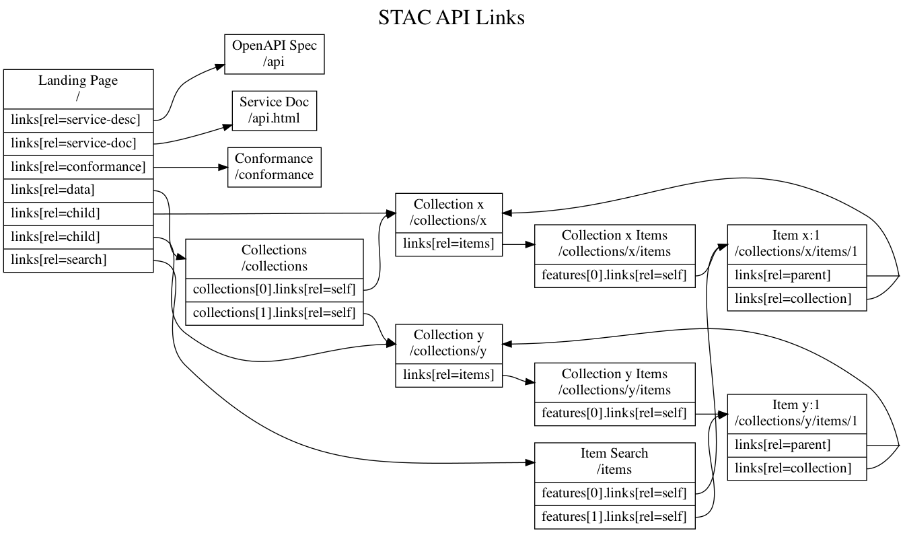

# STAC API - Core Specification

- [STAC API - Core Specification](#stac-api---core-specification)
  - [Recommended Link Relations at `/`](#recommended-link-relations-at-)

- **OpenAPI specification:** [openapi.yaml](openapi.yaml) describes the core endpoints ([rendered version](https://api.stacspec.org/v1.0.0-beta.1/core)),
  and [commons.yaml](commons.yaml) is the OpenAPI version of the core [STAC spec](../stac-spec) JSON Schemas.
- **Conformance URI:** <https://api.stacspec.org/v1.0.0-beta.1/core>
- **Extension [Maturity Classification](../extensions.md#extension-maturity):** Pilot
- **Dependencies**: None

The base of a STAC API is its landing page. This resource is the starting point to discover what behaviors the API supports via link relations. 
This behavior in a RESTful API is known as Hypermedia as the Engine of Application State (HATEOAS). STAC API relies heavily on hypermedia for API endpoint
navigation. 

```json
{
    "stac_version": "1.0.0-beta.2",
    "id": "example-stac",
    "title": "A simple STAC API Example",
    "description": "This Catalog aims to demonstrate the a simple landing page",
    "links": [
        {
            "rel": "self",
            "type": "application/json",
            "href": "https://stacserver.org"
        },
        {
            "rel": "root",
            "type": "application/json",
            "href": "https://stacserver.org"
        },
        {
            "rel": "conformance",
            "type": "application/json",
            "href": "https://stacserver.org/conformance"
        },
        {
            "rel": "service-desc",
            "type": "application/vnd.oai.openapi+json;version=3.0",
            "href": "https://stacserver.org/api"
        },
        {
            "rel": "service-doc",
            "type": "text/html",
            "href": "https://stacserver.org/api.html"
        },
        {
            "rel": "data",
            "type": "application/json",
            "href": "https://stacserver.org/collections"
        },
        {
            "rel": "child",
            "type": "application/json",
            "href": "https://stacserver.org/collections/sentinel-2",
        },
        {
            "rel": "child",
            "type": "application/json",
            "href": "https://stacserver.org/collections/landsat-8",
        },
        {
            "rel": "search",
            "type": "application/geo+json",
            "href": "https://stacserver.org/search"
        }
    ],
    "conformsTo" : [
        "https://api.stacspec.org/v1.0.0-beta.1/core",
        "https://api.stacspec.org/v1.0.0-beta.1/item-search",
        "http://www.opengis.net/spec/ogcapi-features-1/1.0/conf/core",
        "http://www.opengis.net/spec/ogcapi-features-1/1.0/conf/oas30",
        "http://www.opengis.net/spec/ogcapi-features-1/1.0/conf/geojson"
    ]
}
```

There are a few requirements for the returned document:

- The returned JSON must be a valid [STAC Catalog](../stac-spec/catalog-spec/catalog-spec.md), and it can provide any number of 'child' links
to navigate down to additional Catalog, [Collection](../stac-spec/collection-spec/README.md), and [Item](../stac-spec/item-spec/README.md) objects.
- The `links` section is a required part of STAC Catalog, and serves as the list of API endpoints. These can live at any location, the 
client must inspect the the `rel` (relationship) to understand what capabilities are offered at each location.
- The `conformsTo` section must provide the capabilities of this service. The relevant conformance URI's are listed in each part of the
API specification. If a conformance URI is listed then the service must implement all of the required capabilities.

Note the `conformsTo` JSON object follows exactly the structure of OGC API - Features [declaration of conformance 
classes](http://docs.opengeospatial.org/is/17-069r3/17-069r3.html#_declaration_of_conformance_classes), except is available directly under 
the landing page. This is a slight break from how OGC API does things, as STAC feels it is important for clients to be able to understand
conformance in a single request. To be conformant to OGC API's the `/conformance` endpoint must be implemented as well.

This particular catalog provides the ability to browse down to child STAC Collection objects through its `child` links, and also provides the search
endpoint to be able to search across items in its collections. Note though that none of those links are required, other servers may provide
different conformance classes and a different set of links. 

The only requirements of the STAC API core class are to provide a valid STAC Catalog that includes a valid `conformsTo` JSON object
in it. Any API implementing that is considered a valid STAC API, and clients can inspect the document to figure out what other
capabilities are on offer and how to reach them.

The root endpoint (`/`) is most useful when it presents a complete `Catalog` representation of all the data contained in the API, such 
that all `Collection` and `Item` objects can be navigated to by transitively traversing links from this root. This spec does not require any 
API endpoints from OAFeat or STAC API to be implemented, so the following links may not exist if the endpoint has not been implemented.

## Recommended Link Relations at `/`



In each node of the diagram above, there is also a `self` and `root` link that are not depicted to keep the digram more concise.


| **`rel`** | **href to**                                | **From**           | **Description**                                                  |
|-----------|--------------------------------------------|--------------------|------------------------------------------------------------------|
| `root`    | The root URI                               | STAC Core          | Reference to self URI |
| `self`    | The root URI                               | OAFeat             | Reference to self URI  |
| `conformance` | OGC `/conformance` endpoint            | OAFeat / OACommon  | Only required for OGC API Compliant implementations              |
| `service-desc` | The OpenAPI service description       | OAFeat OpenAPI   | Uses the `application/vnd.oai.openapi+json;version=3.0` media type to refer to the OpenAPI 3.0 document that defines the service's API |
| `service-doc`  | An HTML service description           | OAFeat OpenAPI   | Uses the `text/html` media type to refer to a human-consumable description of the service |
| `data`    | OAFeat/OACommon `/collections` endpoint    | Commons Collection | The full list of Collection objects provided by the API                 |
| `child`   | The child STAC Catalogs & Collections      | STAC Core          | Provides curated paths to get to STAC Collection and Item objects      |
| `search`  | The STAC search endpoint (often `/search`) | STAC Search        | Cross-collection query endpoint to select sub-sets of STAC Item objects |

It is also valid to have `item` links from the landing page, but most STAC API's are used to serve up a large number of features, so they typically
use several layers of intermediate `child` links before getting to Items.
